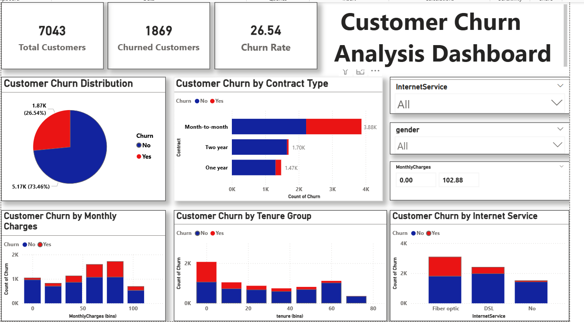

# 📊 Customer Churn Analysis

## 📌 Overview
Analyzed telecom customer data to identify churn patterns and improve retention strategies.

## 🛠 Tools
- Power BI
- Python (Pandas)
- Excel

## 📊 Key Insights
- High churn in month-to-month contracts
- Fiber optic users show higher churn
- Low tenure customers are most at risk

## 📊 Dashboard Preview

## 💡 Business Recommendations
- Promote long-term contracts
- Improve fiber service quality
- Target new customers with retention offers
